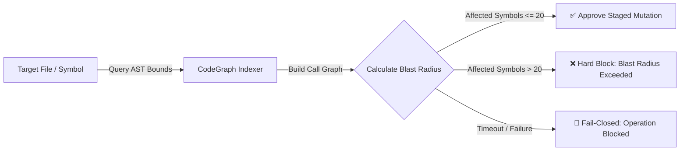
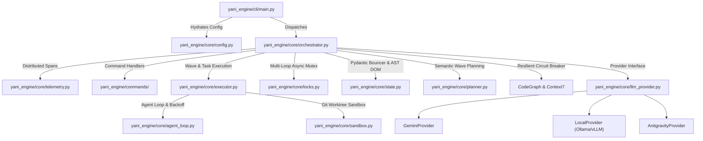
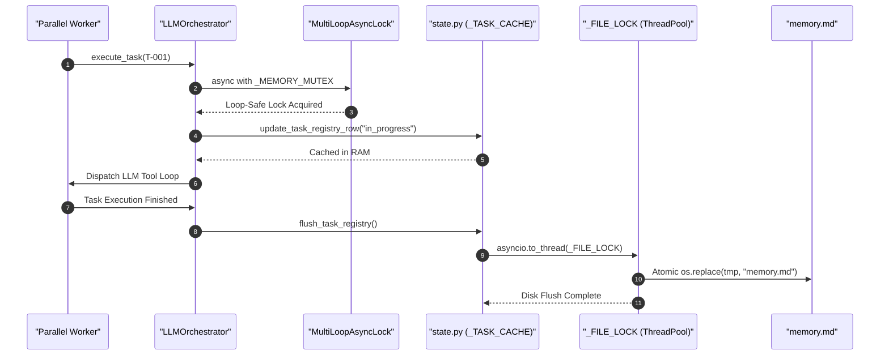

# 🐩 yani-engine

**The Production-Grade Safety Harness for Autonomous AI Coding Agents.**

[](tests/)
[](pyproject.toml)
[](Dockerfile)
[](yani_engine/core/telemetry.py)
[](LICENSE)

---

## 🎯 The 5-Second Hook: Deterministic Containment

Autonomous AI coding agents fail not from lack of capability, but from lack of **containment**. When an unconstrained LLM attempts a wide refactor, it risks cascading regressions, silent token bleed, and untracked filesystem mutations.

**`yani-engine` wraps non-deterministic LLMs in deterministic, enterprise-grade guardrails:**


> **In the demo above:** `yani-engine` intercepts a wide refactor, queries CodeGraph to measure the symbol call tree, detects an unsafe blast radius (42 symbols > 20 limit), activates a **Fail-Closed** block, autonomously decomposes the mutation into atomic waves, and pauses for human Diff-Gate authorization.

---

## ⚡ Enterprise Containment vs Unbounded Agents

| Risk Vector | Unbounded Agent Frameworks | `yani-engine` Deterministic Harness |
| :--- | :--- | :--- |
| **Blast Radius** | Unchecked multi-file edits risk cascading repo breakage | **Hard AST Limit ( $\le 20$ symbols)** via CodeGraph reference trees |
| **Execution Safety** | Executes code directly on host machine | **Zero-Trust Docker Sandbox** isolated in ephemeral Git worktrees |
| **Review & Rollback** | Commits directly or leaves dirty working trees | **Interactive Diff-Gate** with shadow copies & 1-click rollback |
| **Process Resilience** | Hanging external tools deadlock agent loops | **Stateful Circuit Breakers** with fail-closed timeouts (5s) |
| **Token Consumption** | Giant error dumps cause runaway token bleed | **Pydantic Bouncers** capping error envelopes to $\le 1600$ chars |
| **State Integrity** | Fragile string regex clobbers task state | **AST DOM Manipulation (`markdown-it-py`)** with `MultiLoopAsyncLock` |

---

## 🚀 60-Second Quickstart

`yani-engine` can be run **Standalone via CLI** or as a **Native Plugin** for Antigravity (`agy`).

### 1. Standalone CLI (Recommended for Direct Usage)

```bash
# Clone & install in isolated virtual environment
git clone https://github.com/emmanuelol/yani-engine.git
cd yani-engine
uv venv .venv && source .venv/bin/activate
uv pip install -e .

# Build the Zero-Trust Sandbox Base Image
docker build -t yani-base:latest .

# Configure API Key
export GEMINI_API_KEY="your-gemini-api-key"

# Run your first safe refactor
yani start "Refactor auth middleware to validate JWT expiry"
yani execute
```

### 2. Antigravity Client Plugin (`agy`)

```bash
# Automated global installer
./install.sh

# Or link directly into agy
agy plugin install ./
```

---

## 🛡️ Core Safety & Containment Pillars

### 1. AST Blast-Radius Analysis (CodeGraph)

* Queries Abstract Syntax Tree call graphs before touching code.
* **20-Symbol Cap**: If a proposed change cascades to $>20$ external symbols, the mutation is blocked and forced into atomic wave decomposition.
* **Fail-Closed Ceiling**: If graph indexing times out (5-second hard ceiling), mutations are rejected.

### 2. Zero-Trust Sandbox (Git Worktree Isolation)
* Sub-agents execute testing and bash operations inside isolated Docker containers (`yani-base:latest`).
* Mounted to ephemeral Git Worktrees (`.yani/shadow_{worker_id}`) leveraging Git's internal object store for instantaneous zero-disk-bloat provisioning.

### 3. Interactive Diff-Gate & Instant Rollback
* Changes are staged to `.tmp` files while originals are snapshotted in `.yani/rollbacks/{task_id}/`.
* Visual before/after diff presented via VS Code or terminal-native `rich` UI.
* Rejecting a change immediately restores the pristine original without side effects.

### 4. Stateful MCP Circuit Breakers
* External subprocesses (`npx` codegraph, context7) are protected by a stateful `PersistentCircuitBreaker`.
* Fast-fails after 3 consecutive errors to prevent event loop starvation; probes in `HALF-OPEN` state for automatic recovery.

### 5. Pydantic Tool Bouncers & Token Guardrails
* State mutations (`update_task_registry_row`, `register_task_batch`) validate payloads against strict Pydantic schemas before acquiring memory mutexes.
* Malformed LLM error dumps are strictly capped at $\le 1600$ characters with a `[TRUNCATED]` warning, eliminating token-bleed death spirals.

---

## ⚖️ Strategic Architectural Tradeoffs

Senior engineering leadership is defined by conscious tradeoffs:

* **[ADR-001: Markdown AST DOM (`memory.md`) Over SQLite](docs/adrs/ADR-001-memory-md-over-sqlite.md)**: We deliberately chose a Markdown AST DOM (`markdown-it-py`) over an embedded SQLite database. This guarantees human-readability, git-trackability of all agent decisions, and zero external DB dependencies, while mitigating concurrency risks via `MultiLoopAsyncLock` and atomic disk flushes.
* **Vendor Tiering (Brain vs Hands)**: Heavy architectural refactors (`large` effort) route to cloud models (Gemini Pro), while small file audits route to local models (Ollama/vLLM) to conserve budget.
* **[ROADMAP.md](ROADMAP.md)**: Detailed phase milestones spanning local containment, enterprise OTel visualizers, and distributed multi-agent mesh.

---

## 💡 Dual Execution Modes

| Feature | `yani-engine` (Full Enterprise Harness) | `yani-skill` (Lite Fast-Path) |
| :--- | :--- | :--- |
| **Execution** | Autonomous multi-agent background waves | Single-turn, interactive developer pairing |
| **Sandbox** | Zero-trust Docker container (`yani-base:latest`) | Native workspace branch (`yani/T-XX`) |
| **State** | Persistent `memory.md` DOM state & checkpoints | Transient branch isolation & `plan.json` |
| **Safety Gate** | CodeGraph AST impact + Diff-Gate | Historical git co-change + Diff-Audit |
| **Command** | `/yani-engine start`, `/yani-engine execute` | `/yani-skill implement "..."` |
| **Best For** | Massive repo refactors & background tasks | Daily feature development & quick bug fixes |

---

## 🏗️ System Architecture & Concurrency





---

## 📊 OpenTelemetry & Observability

* **Distributed Spans (`@trace_async_step` & `trace_span`)**: Structured spans for CLI commands (`command.execute`), parallel waves (`wave.execute`), individual worker tasks (`wave.worker_task`), and MCP tool executions (`mcp.call_tool`).
* **Real-Time Metrics**:
  * `yani_engine_llm_tokens_total`: Prompt, completion, and cached tokens per model.
  * `yani_engine_llm_latency_seconds`: Vendor round-trip latency histogram.
  * `yani_engine_mcp_tool_duration_seconds`: MCP tool execution latency.
  * `yani_engine_circuit_breaker_events_total`: Metric tracking trips and resets.
* **OTLP / Structlog Export**: Export directly to Jaeger, Grafana Tempo, or Honeycomb via `--otlp-endpoint`.

---

## 🔄 Command Summary

* **/yani-engine start**: Ingests requirements, evaluates AST blast radius, and maps an atomic task plan.
* **/yani-engine execute**: Dispatches tasks in parallel waves through the Docker sandbox.
* **/yani-engine iterate**: Refines existing plans based on new user requirements.
* **/yani-engine audit**: Autonomous QA Harness loop testing completed tasks and generating fix tasks.
* **/yani-engine generate-demo**: Deterministic VHS + Docker demo generation for documentation.
* **/yani-engine resume**: Recovers interrupted wave sessions from disk checkpoints.
* **/yani-engine rollback**: Restores working tree from `.yani/rollbacks/` checkpoints.
* **/yani-engine report**: Summarizes CodeGraph impact, token usage, and completed waves.
* **/yani-engine update-docs**: Synchronizes repository documentation with codebase state.
* **/yani-engine status**: Displays task registry state and CodeGraph health.
* **/yani-skill**: Lite Mode fast-path planner using historical git co-change and diff audits.

---

## 🧪 Verification & Test Suite

Run the full automated test suite (65 unit, integration, and chaos tests):

```bash
pytest tests/ -q
```

```
.................................................................        [100%]
65 passed, 2 warnings in 5.68s
```

See [CONTRIBUTING.md](CONTRIBUTING.md) for testing guidelines and pull request workflows.

---

## 👥 Authors

Created and maintained by:
* **Emmanuel** ([@emmanuelol](https://github.com/emmanuelol))
* **Carlos** ([@carlosaol](https://github.com/carlosaol))

---

## 📄 License

Licensed under the **[MIT License](LICENSE)**. Includes complete liability insulation for enterprise and open-source adoption.
