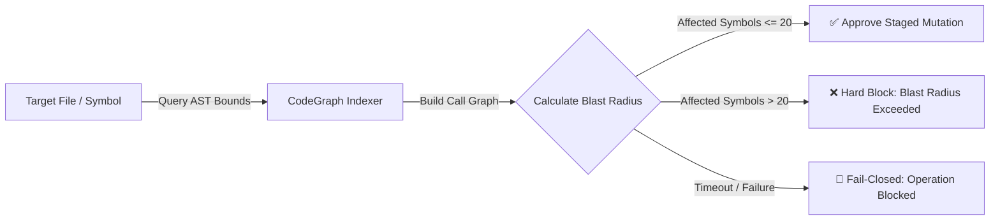
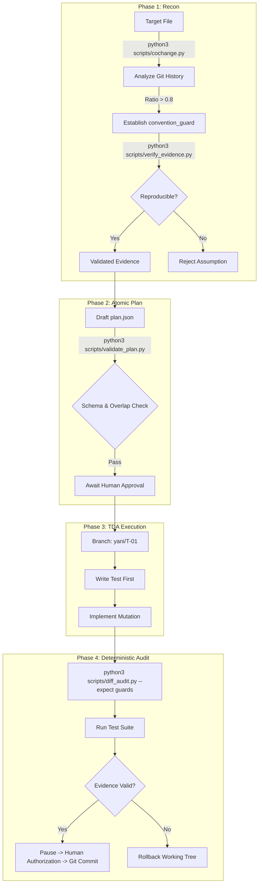
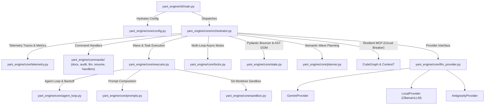
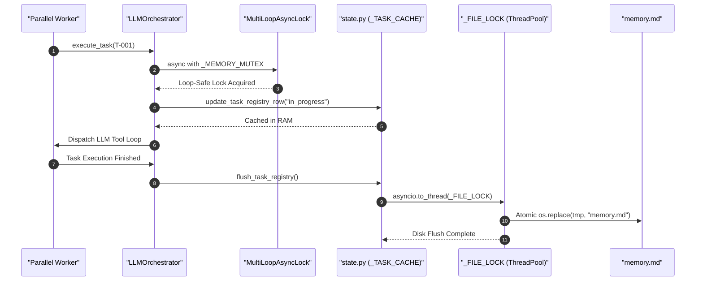

# 🐩 yani-engine

> An advanced, system-wide Agent Engineering Harness for Antigravity (`agy`).

Welcome to **yani-engine**! 👋 yani-engine is an advanced, autonomous framework designed to give your AI agent the tools, constraints, and state-tracking necessary to safely audit, refactor, and optimize complex software repositories.

It operates on a **"Zero-Copy Plugin"** model. Instead of polluting every target repository with agent scripts, it acts as a native plugin for the `agy` client, running out of one centralized location on your machine.

---

## 📑 Table of Contents

- [🚀 Core Technologies](#-core-technologies)
- [🔍 CodeGraph Deep-Dive Integration](#-codegraph-deep-dive-integration)
- [💡 yani-skill: The "Lite" Fast-Path Companion](#-yani-skill-the-lite-fast-path-companion)
- [🛠️ Installation](#️-installation)
- [🔑 Authentication & Configuration](#-authentication--configuration)
- [🛡️ Security Features](#️-security-features)
- [🏗️ Core Architecture (Decoupled & Modular)](#️-core-architecture-decoupled--modular)
- [⚡ Token Optimization Architecture](#-token-optimization-architecture)
- [🔒 Concurrency & Multi-Loop Safety](#-concurrency--multi-loop-safety)
- [🔄 The Workflow & Command Summary](#-the-workflow--command-summary)
  - [🎓 Example: Your First Autonomous Refactor](#-example-your-first-autonomous-refactor)
- [👥 Authors](#-authors)
- [📄 License](#-license)

---

## 🚀 Core Technologies

Under the hood, yani-engine leverages powerful, modern tools to give you the safest and most efficient agentic experience:

* **CodeGraph (AST Blast-Radius Analysis):** Maps deep Abstract Syntax Tree (AST) relationships, reference graphs, and symbol call trees to calculate impact radius before applying code mutations.
* **Context7 (Semantic Documentation Search):** Real-time semantic documentation retrieval for external libraries and APIs.
* **MCP (Model Context Protocol):** Standardized RPC bridges connecting sub-agents seamlessly to CodeGraph, Context7, and custom tool sidecars.
* **[uv](https://github.com/astral-sh/uv):** Lightning-fast, isolated Python environments, ensuring host Python integrity.
* **RTK (Rust Token Killer):** High-throughput token optimization CLI proxy, cutting execution overhead and memory consumption by 60–90%.

---

## 🔍 CodeGraph Deep-Dive Integration

yani-engine treats source code as a structured relational graph rather than plain text. Through native MCP and CLI integration, CodeGraph enforces strict architectural guardrails:



1. **AST Node & Call Graph Traversal**: Before any file modification, yani-engine queries CodeGraph to locate exact symbol definitions and trace all upstream/downstream callers across the workspace.
2. **20-Symbol Blast-Radius Limit**: Prevents accidental architectural cascading failures. If modifying a function directly affects more than 20 external symbols, the write is immediately rejected and returned to the LLM for decomposition.
3. **Fail-Closed Diff Gate**: If CodeGraph indexing times out (5-second hard ceiling) or encounters system degradation, yani-engine rejects the modification rather than failing open.
4. **Semantic Import Coupling in Wave Planning**: `WavePlanner` queries CodeGraph impact caches to detect mutual import dependencies between tasks, preventing race conditions by scheduling coupled tasks into sequential waves.

---

## 💡 `yani-skill`: The "Lite" Fast-Path Companion

Need deterministic planning without the overhead of Docker containers or multi-agent orchestrators? 

**`yani-skill`** (invoked via `/yani-skill` or `/yani-engine:yani-skill`) is the friendly, **Lite edition** of `yani-engine`. It runs directly in your active workspace, delivering instant evidence-based pairing, git convention detection, and strict diff auditing.

| Feature | `yani-engine` (Full Harness) | `yani-skill` (Lite Fast-Path) |
| :--- | :--- | :--- |
| **Execution Mode** | Autonomous multi-agent background waves | Single-turn, interactive developer pairing |
| **Sandbox Environment** | Zero-trust Docker container (`yani-base`) | Native workspace with zero setup |
| **State Tracking** | Persistent `memory.md` DOM state & checkpoints | Transient branch isolation (`yani/T-XX`) |
| **Safety Gates** | CodeGraph AST impact + Diff-Gate | Historical git co-change + Diff-Audit |
| **Best For** | Massive repo refactors & background tasks | Daily feature development & quick bug fixes |

### `yani-skill` 4-Phase Lifecycle



### Key Tooling in `skills/yani-skill/scripts/`

* **`cochange.py`**: Scans `git log` to calculate historical coupling between files. If editing `A.py` historically coincided with `B.json` in >80% of commits, `B.json` becomes an unbreakable `convention_guard`.
* **`verify_evidence.py`**: Re-evaluates co-change findings against a specific git commit SHA, ensuring assertions are reproducible and not hallucinated.
* **`validate_plan.py`**: Verifies that `plan.json` adheres to strict atomic schema rules and that no two concurrent tasks touch overlapping files.
* **`diff_audit.py`**: Compares the working tree against the base branch, ensuring no undeclared files were modified and that all `--expect` convention guards were fulfilled.

---

## 🛠️ Installation

Installing yani-engine is incredibly straightforward. You install it as a native plugin to `agy` by pointing it to your local repository clone.

1. Clone this repository to your local machine:
```bash
git clone https://github.com/emmanuelol/yani-engine.git
cd yani-engine
```

2. Install the plugin natively via `agy` (Global Client Linking):
```bash
agy plugin install ./
```

3. (Optional) Run the automated installer to initialize dependencies and Docker base sandbox:
```bash
./install.sh
```

That's it! yani-engine is now hooked into your `agy` environment. 🎉

---

## 🔑 Authentication & Configuration

yani-engine uses `pydantic-settings` to inject dependencies efficiently. You can define a `.env` file or export variables globally:

```bash
export GOOGLE_API_KEY="your-api-key-here"
export GEMINI_API_KEY="your-api-key-here"
```

yani-engine also supports **Native Antigravity Integration**. If the plugin detects it is running inside an active `agy` environment, it will automatically use the `AntigravityProvider` to consume native account credits without requiring explicit keys.

---

## 🛡️ Security Features

yani-engine prioritizes safety during execution with two primary mechanisms:
* **VS Code Diff-Gate**: File changes are written to a shadow `.tmp` copy while the original is backed up in `.yani/rollbacks/{task_id}/`. If you reject a change during review, yani-engine automatically restores the original file. If VS Code is unavailable, a terminal-native `rich` diff is used.
* **Zero-Trust Docker Sandbox (Git Worktree Isolation)**: Sub-agents execute testing and bash operations inside isolated Docker containers (`yani-base:latest`) mounted to ephemeral Git Worktrees (`.yani/shadow_{worker_id}`). By leveraging Git's internal object store rather than physical directory duplication, sandbox provisioning is instantaneous with zero disk bloat. Includes automatic fallback to atomic copies for non-git workspaces, plus crash-resilient branch/worktree pruning hooks.

---

## 🏗️ Core Architecture (Decoupled & Modular)

yani-engine has a strictly decoupled, production-grade architecture designed for scale, resilience, and full observability.



### Dynamic Vendor Tiering

yani-engine automatically balances cost and performance by routing tasks based on their estimated effort:
* **The Brain (Cloud):** Heavy architectural refactors (`large` effort) are routed to powerful cloud models like `gemini-3.1-pro-preview`.
* **The Hands (Local):** Simple file changes and audits (`small`/`medium` effort) are routed to local inference hardware via Ollama or vLLM to conserve API credits.

---

## 📊 OpenTelemetry & Observability

yani-engine includes enterprise-grade OpenTelemetry tracing and metrics instrumentation:

* **Distributed Spans (`@trace_async_step` & `trace_span`)**: Automatically creates structured spans for CLI commands (`command.execute`), parallel waves (`wave.execute`), individual worker tasks (`wave.worker_task`), LLM inference turns (`llm.send_message`), and MCP tool executions (`mcp.call_tool`).
* **Real-Time Token & Latency Metrics**:
  * `yani_engine_llm_tokens_total`: Counter tracking prompt, completion, cached, and total tokens per model and command.
  * `yani_engine_llm_latency_seconds`: Histogram tracking vendor round-trip latency.
  * `yani_engine_mcp_tool_duration_seconds`: Histogram measuring MCP RPC tool execution latency.
  * `yani_engine_circuit_breaker_events_total`: Metric tracking circuit breaker trips and resets.
* **OTLP / Structlog Export**: Output traces directly to OTLP collectors (Jaeger, Grafana Tempo, Honeycomb) via `--otlp-endpoint` or formatted JSON / colorized terminal logs.

---

## 🛡️ MCP Persistent Circuit Breaker

External MCP subprocesses (`npx` codegraph and context7) are protected by a stateful `PersistentCircuitBreaker`:
* **State Persistence**: Serializes trip state to `.yani/cache/circuit_breaker_{server}.json` with configurable TTL (default 10 minutes).
* **Fault Isolation**: If a tool fails consecutively (threshold = 3), the circuit trips to `OPEN`, immediately fast-failing downstream calls to prevent event loop starvation.
* **Probing / Half-Open**: Periodically probes offline servers with lightweight ping calls to automatically recover when dependencies restart.

---

## ⚡ Token Optimization & State Bouncers

yani-engine employs multi-layered defense to minimize API token consumption and safeguard LLM context windows:
* **Caveman Integration**: Enforces ultra-compressed communication, cutting token usage by up to 75%.
* **Pydantic Tool Bouncers**: All state-mutation tools (`update_task_registry_row`, `register_task_batch`) validate inputs against strict Pydantic schemas (`UpdateTaskStatusPayload`, `TaskBatchPayload`) before acquiring memory mutexes.
* **Token-Bleed Envelope Guardrails**: If an LLM hallucinates a massive malformed payload (e.g. 50k+ characters), the validation error trace is strictly capped at $\le 1600$ characters with a `[TRUNCATED]` warning, preventing catastrophic prompt history bloat while preserving actionable error feedback for self-correction.
* **Dynamic Tool Filtering**: Commands receive only the exact tools they need.
* **Sliced Memory Ingestion**: Injects only targeted sections of `memory.md` during loops.
* **Mid-Loop Budget Enforcement**: Validates token budgets after every tool cycle to prevent unbounded consumption.

---

## 🔒 Concurrency & Multi-Loop Safety

yani-engine executes tasks in parallel waves via `asyncio.gather`. To prevent state corruption and event loop deadlocks:



* **MultiLoopAsyncLock Proxy**: Preserves global singleton object identity across imports while dynamically routing lock futures to the active event loop, preventing `RuntimeError: Event loop is closed` across multi-cycle test suites.
* **Non-Blocking File Locking**: Cross-process `_FILE_LOCK` acquisitions run on background thread pools (`asyncio.to_thread`), preventing 120-second filesystem lock waits from freezing the main asyncio event loop.
* **AST DOM Manipulation**: Utilizes a custom `ASTMemoryMapper` (backed by `markdown-it-py`) to manipulate markdown blocks as a structural DOM, eliminating race conditions and string-clobbering bugs.
* **Resilient Table CRUD**: Uses `split_markdown_cells` and `format_markdown_row` to protect table serialization from unescaped pipe collisions.

---

## 🔄 The Workflow & Command Summary

* **/yani-engine start**: Ingests documentation and maps out an atomic task plan.
* **/yani-engine execute**: Executes registered tasks in dependency order.
* **/yani-engine iterate**: Evaluates user prompts against current state and decomposes into tasks.
* **/yani-engine audit**: Runs the QA Harness Loop to autonomously generate fixes.
* **/yani-engine resume**: Detects interrupted tasks and offers recovery options.
* **/yani-engine rollback**: Safely restores files from checkpoints.
* **/yani-engine report**: Generates an improvement report detailing CodeGraph impact.
* **/yani-engine update-docs**: Syncs documentation with the current codebase.
* **/yani-engine status**: Shows the Task Registry and CodeGraph health.
* **/yani-engine:yani-skill** (or `/yani-skill`): **Lite Mode** — Deterministic, evidence-based planner and auditor using co-change history and diff audits.

### 🎓 Example: Your First Autonomous Refactor

Let's walk through using `yani-engine` to safely update a deprecated API across your project:

1. **Initialize the Agent:** Navigate to your project directory and run `/yani-engine start`. Provide a prompt like: *"Refactor all instances of the v1 Auth API to use the new v2 JWT endpoints."*
2. **Review the Plan:** `yani-engine` will map the codebase using CodeGraph, identifying exactly which files depend on the old API, and generate a task plan in `memory.md`.
3. **Authorize Execution:** Run `/yani-engine execute`. Sub-agents will begin modifying files in an isolated Docker sandbox.
4. **Approve the Diffs:** Before any code is committed, the VS Code Diff-Gate will pause execution and present you with a clean before/after comparison. 
5. **Finalize:** Once you approve the changes, the rollback copies are cleared, and the updated code is written directly to your working tree.

---

## 👥 Authors

Created and maintained by:
* **Emmanuel** ([@emmanuelol](https://github.com/emmanuelol))
* **Carlos** ([@carlosaol](https://github.com/carlosaol))

---

## 📄 License

This project is licensed under the **MIT License** — see the [LICENSE](LICENSE) file for details. Included is an ironclad warranty disclaimer providing complete liability insulation for open-source and commercial adoption.

