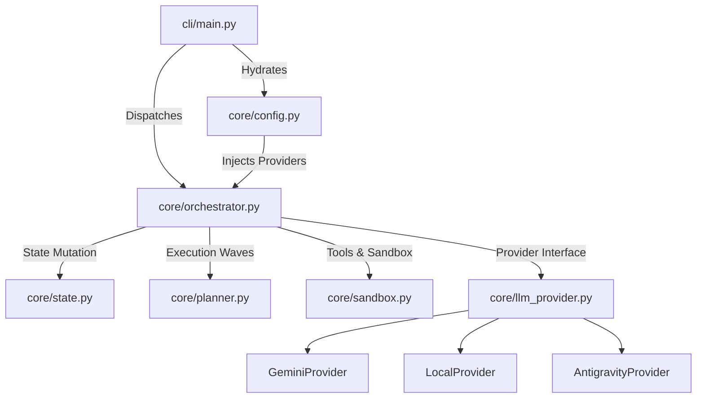
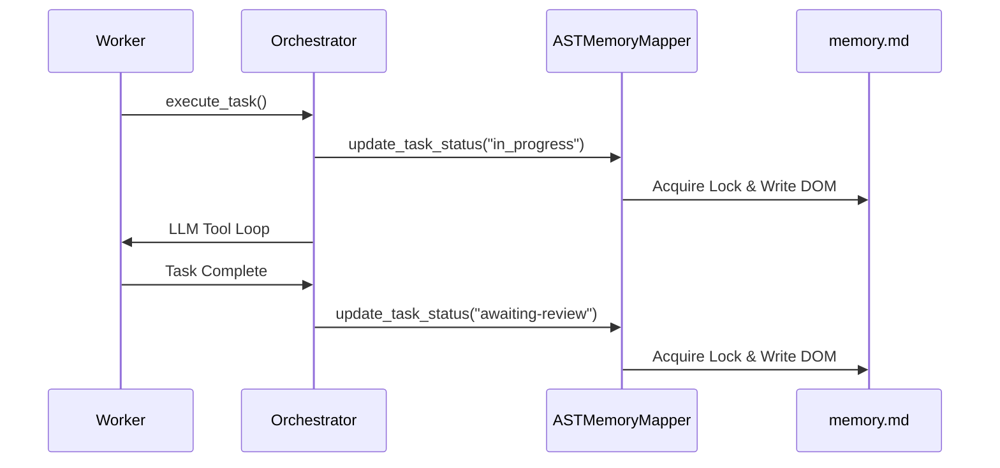

# 🐩 yani-engine

> An advanced, system-wide Agent Engineering Harness for Antigravity (`agy`).

Welcome to **yani-engine**! 👋 yani-engine is an advanced, autonomous framework designed to give your AI agent the tools, constraints, and state-tracking necessary to safely audit, refactor, and optimize complex software repositories.

It operates on a **"Zero-Copy Plugin"** model. Instead of polluting every target repository with agent scripts, it acts as a native plugin for the `agy` client, running out of one centralized location on your machine.

---

## 🚀 Core Technologies

Under the hood, yani-engine leverages powerful, modern tools to give you the safest and most efficient agentic experience:

* **MCP (Model Context Protocol):** Connects to specialized servers like **CodeGraph** (for rigorous blast radius analysis) and **Context7** (for deep semantic search).
* **[uv](https://github.com/astral-sh/uv):** Used for lightning-fast, isolated Python environments, ensuring system Python integrity.
* **RTK (Rust Token Killer):** Integrates this custom system tool to forcefully optimize memory and clear token bloat during heavy architectural refactors.

---

## 🛠️ Installation

Installing yani-engine is incredibly straightforward. You install it as a native plugin to `agy` by pointing it to your local repository clone.

1. Clone this repository to your local machine:
```bash
git clone <repository-url>
cd yani-engine
```

2. Install the plugin natively via `agy` (Global Client Linking):
```bash
agy plugin install ./
```

That's it! yani-engine is now hooked into your `agy` environment. 🎉

---

## 🔑 Authentication & Configuration

yani-engine uses `pydantic-settings` to inject dependencies efficiently. You can define a `.env` file or export variables globally:

```bash
export GOOGLE_API_KEY="your-api-key-here"
export GEMINI_API_KEY="your-api-key-here"
```

yani-engine also supports **Native Antigravity Integration**. If the plugin detects it is running inside an active `agy` environment, it will automatically use the `AntigravityProvider` to consume native account credits without requiring explicit keys.

---

## 🛡️ Security Features

yani-engine prioritizes safety during execution with two primary mechanisms:
* **VS Code Diff-Gate**: File changes are written to a shadow `.tmp` copy while the original is backed up. If you reject a change during review, yani-engine automatically restores the original file. If VS Code is unavailable, a terminal-native `rich` diff is used.
* **Zero-Trust Docker Sandbox (Shadow Clone Isolation)**: Sub-agents execute testing within a fully isolated Docker container using the "Shadow Clone" pattern. The codebase is safely cloned into the sandbox, providing agents with a fully mutable playground that prevents container crashes when installing packages or writing cache files.

---

## 🏗️ Core Architecture (Decoupled & Modular)

yani-engine has a strictly decoupled architecture designed for scale and clarity.



### Dynamic Vendor Tiering

yani-engine automatically balances cost and performance by routing tasks based on their estimated effort:
* **The Brain (Cloud):** Heavy architectural refactors (`large` effort) are routed to powerful cloud models like `gemini-3.1-pro-preview`.
* **The Hands (Local):** Simple file changes and audits (`small`/`medium` effort) are routed to local inference hardware via Ollama or vLLM to conserve API credits.

---

## ⚡ Token Optimization Architecture

yani-engine employs advanced strategies to minimize API token consumption:
* **Caveman Integration**: Enforces ultra-compressed communication, cutting token usage by up to 75%.
* **Dynamic Tool Filtering**: Commands receive only the exact tools they need.
* **Sliced Memory Ingestion**: Injects only targeted sections of `memory.md` during loops.
* **Mid-Loop Budget Enforcement**: Validates token budgets after every tool cycle to prevent unbounded consumption.

---

## 🔒 Concurrency Safety

yani-engine executes tasks in parallel waves via `asyncio.gather`. To prevent state corruption:



* **Unified Locking**: `memory.md` updates acquire both a thread-level `threading.Lock()` and an `asyncio.Lock()` to completely eliminate race conditions.
* **AST DOM Manipulation**: yani-engine utilizes a custom `ASTMemoryMapper` to parse markdown files into a structural DOM model. State updates rely on surgically precise block location rather than fragile string replacements.

---

## 🔄 The Workflow & Command Summary

* **/yani-engine start**: Ingests documentation and maps out an atomic task plan.
* **/yani-engine execute**: Executes registered tasks in dependency order.
* **/yani-engine iterate**: Evaluates user prompts against the current state and decomposes into tasks.
* **/yani-engine audit**: Runs the QA Harness Loop to autonomously generate fixes.
* **/yani-engine resume**: Detects interrupted tasks and offers recovery options.
* **/yani-engine rollback**: Safely restores files from checkpoints.
* **/yani-engine report**: Generates an improvement report detailing CodeGraph impact.
* **/yani-engine update-docs**: Syncs documentation with the current codebase.
* **/yani-engine status**: Shows the Task Registry and CodeGraph health.

