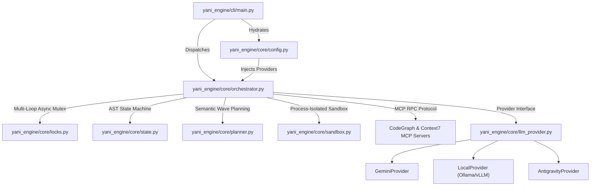
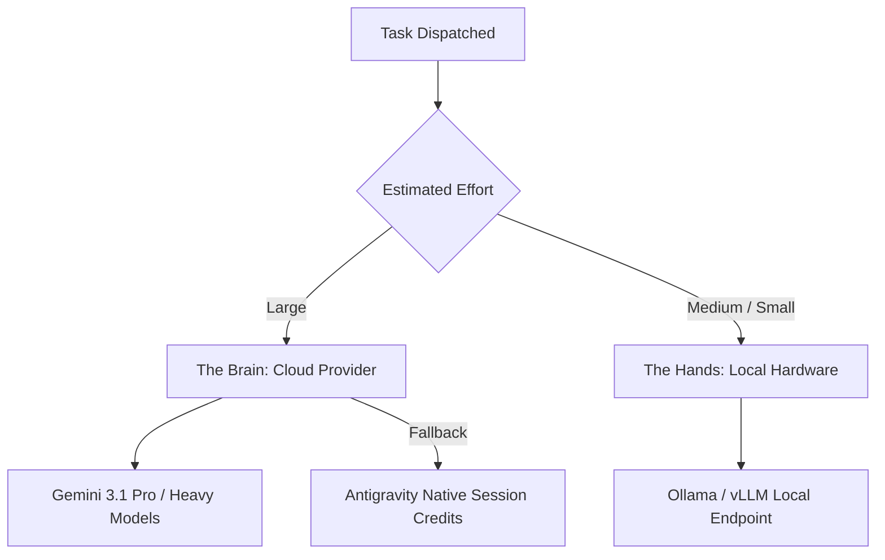
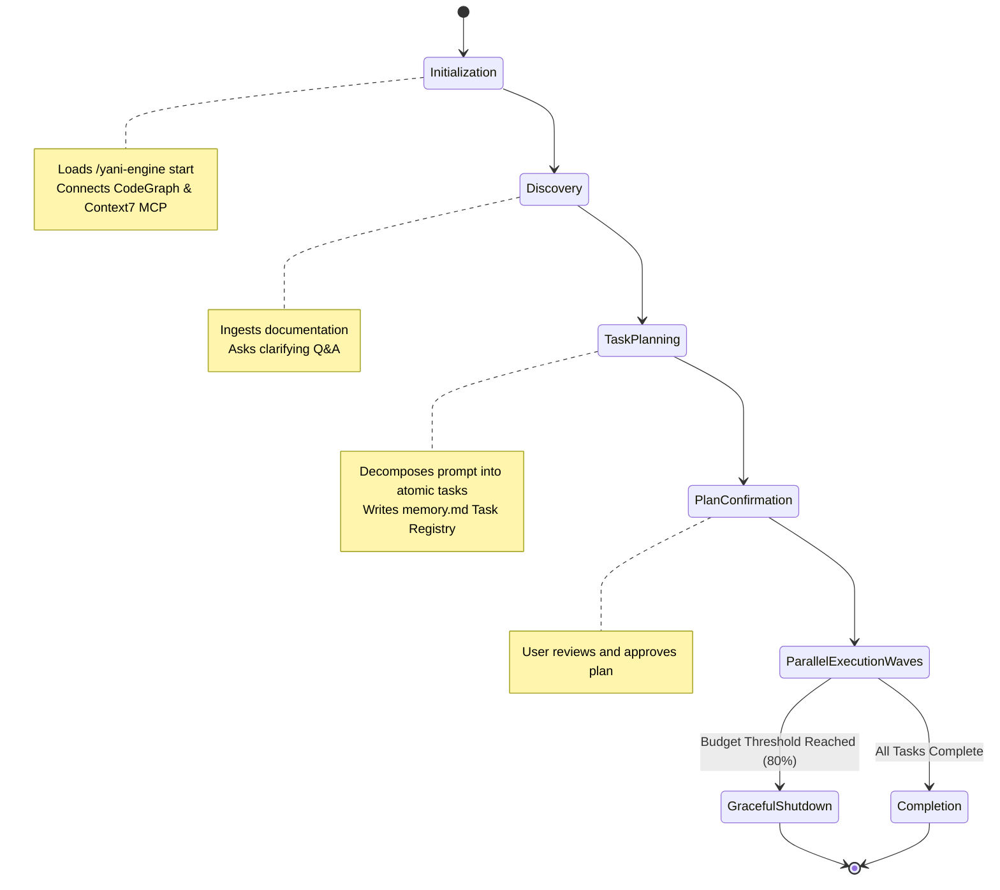
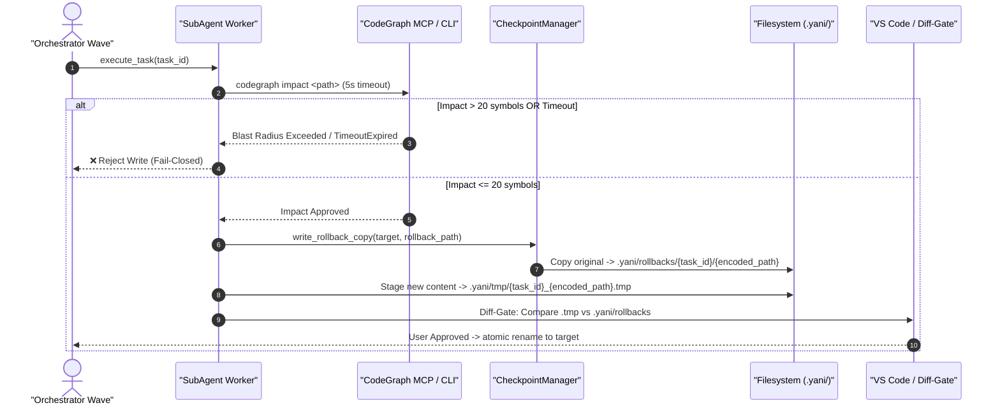
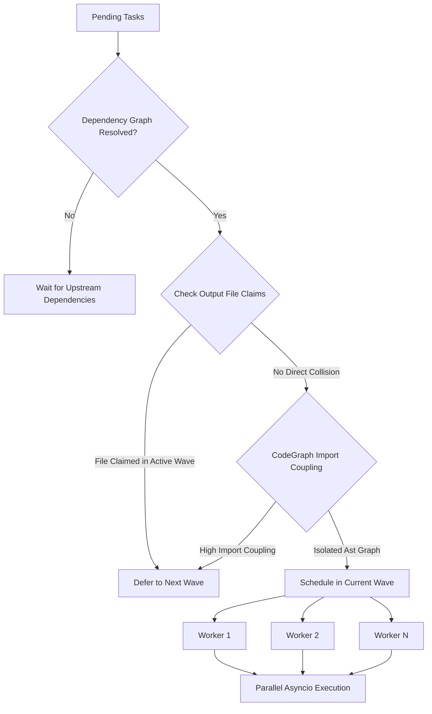
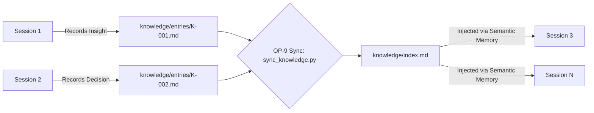

# Architecture and Diagrams

This document visually outlines the core structural components, concurrency models, and security protocols of the **yani-engine** architecture.

---

## 1. Core Decoupled Architecture

---

## 2. Dynamic Vendor Tiering (Brain vs. Hands)

yani-engine natively supports routing tasks to different LLM providers based on estimated effort. 

---

## 3. Session Lifecycle State Machine

---

## 4. Task Execution & Fail-Closed Checkpoint Protocol

---

## 5. Sub-Agent Coordination & Semantic Dependency Model

---

## 6. Knowledge Registry Evolution Flow

---

## 7. State Synchronization & Multi-Loop Mutex Architecture

### The Single-Writer Constraint
All state mutations to `memory.md` MUST route exclusively through `update_task_registry_row()` followed by `flush_task_registry()`. Direct writes via raw file handles are deprecated and strictly forbidden.

### Concurrency Guarantees:
1. **`MultiLoopAsyncLock`**: Idempotent asyncio proxy preserving object memory addresses across imports (`id(get_registry_lock()) == id(orch_lock())`) while dynamically provisioning loop-safe `asyncio.Lock()` instances mapped to `id(asyncio.get_running_loop())`. Eliminates `RuntimeError: Event loop is closed` across multi-cycle test suites.
2. **Non-Blocking FileLock**: Synchronous `filelock.FileLock` operations are offloaded to worker threads via `asyncio.to_thread`, preventing 120-second filesystem lock waits from stalling the main event loop.
3. **AST DOM Manipulation**: The state machine utilizes `ASTMemoryMapper` (backed by `markdown-it-py`) to parse markdown tables into structural DOM representations, preserving arbitrary trailing columns and preventing race conditions.
