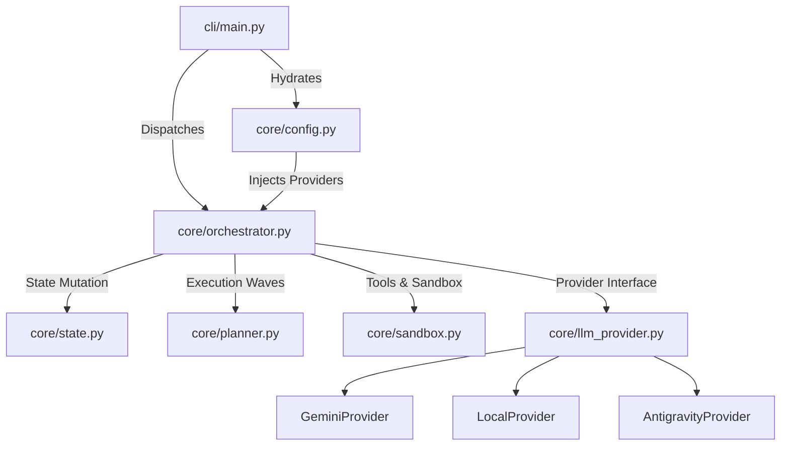
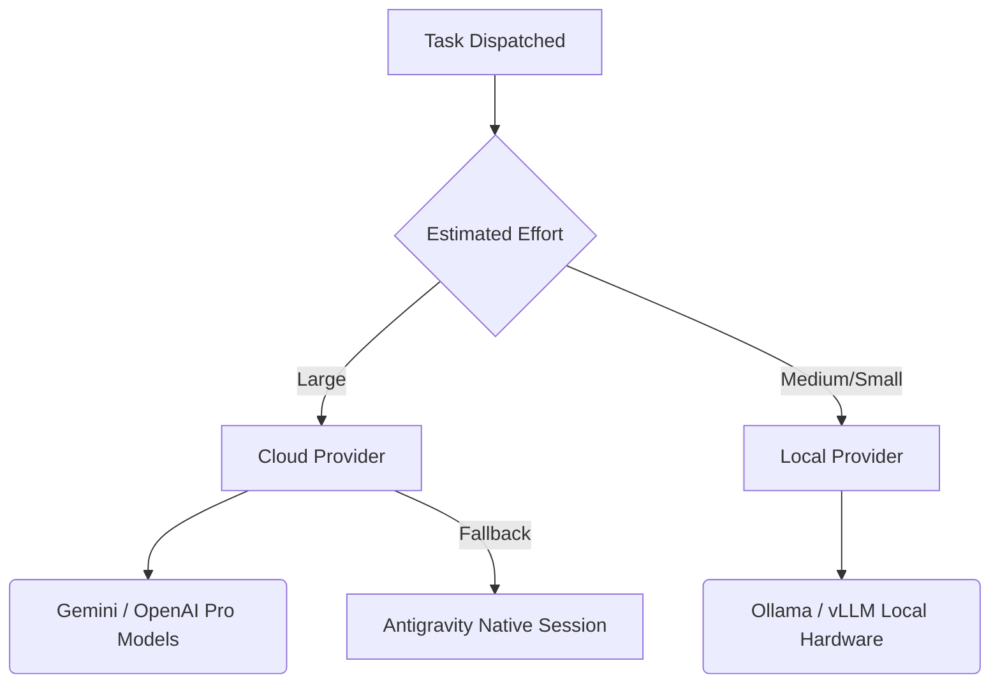
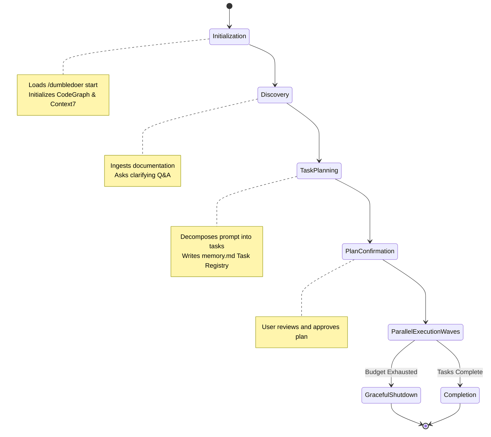
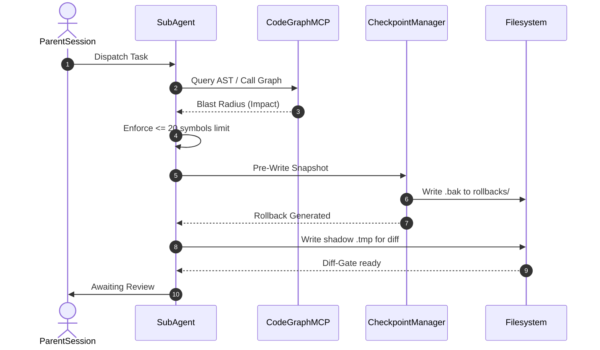
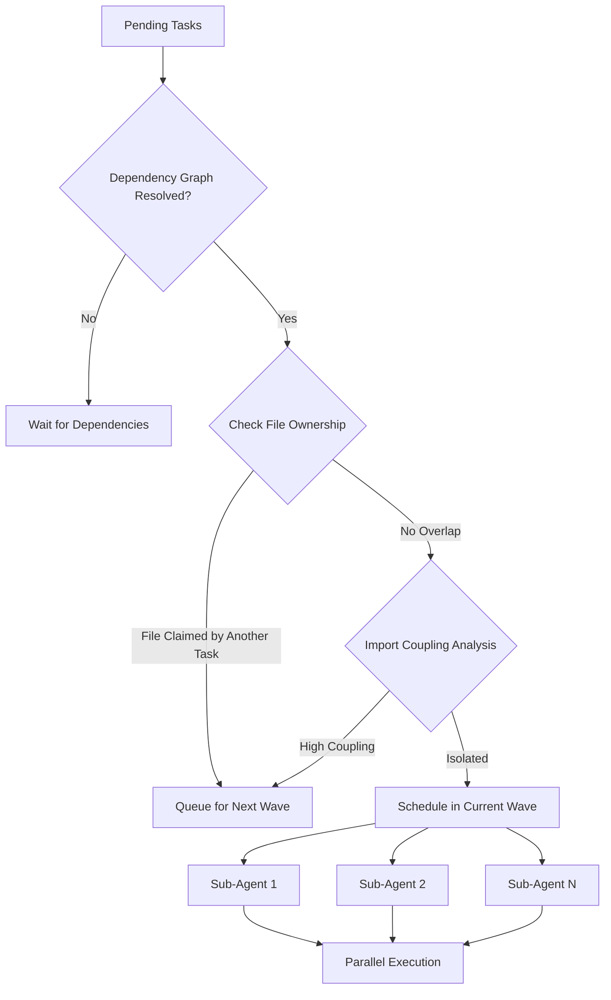
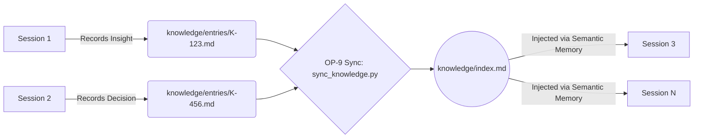

# Architecture and Diagrams

This document visually outlines the core structural components and protocols of the DumbleDoer architecture.

## 1. Core Decoupled Architecture

## 2. Dynamic Vendor Tiering

DumbleDoer natively supports routing tasks to different LLM providers based on estimated effort. 

## 3. Session Lifecycle State Machine

## 4. Task Execution & Checkpoint Protocol Sequence

## 5. Sub-Agent Coordination & File Ownership Model

## 6. Knowledge Registry Evolution Flow

